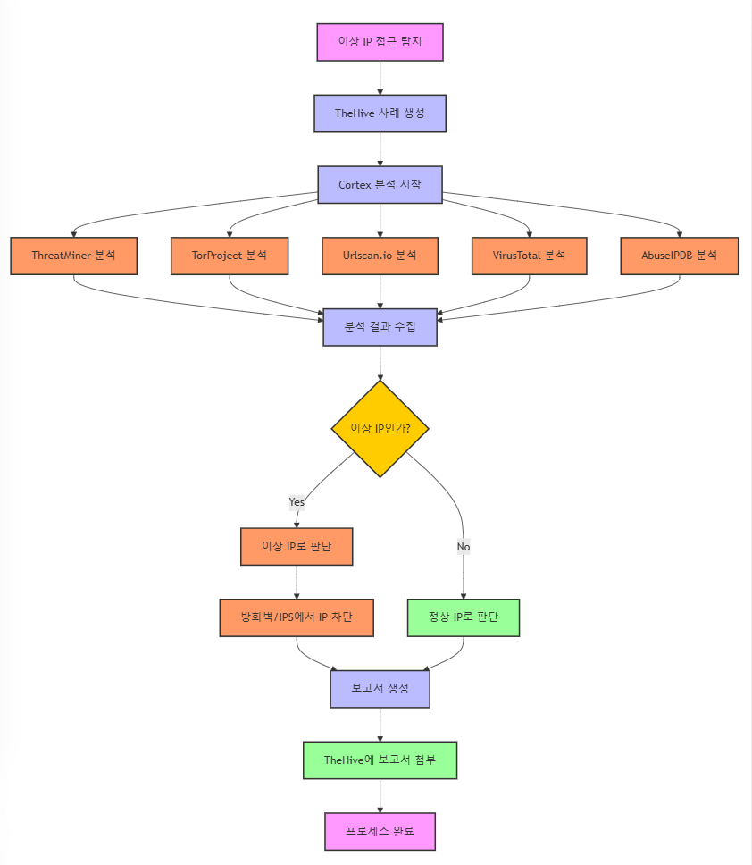
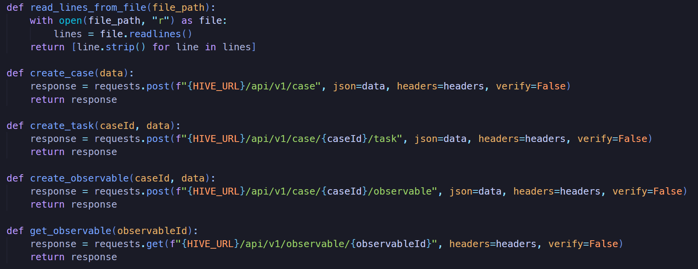
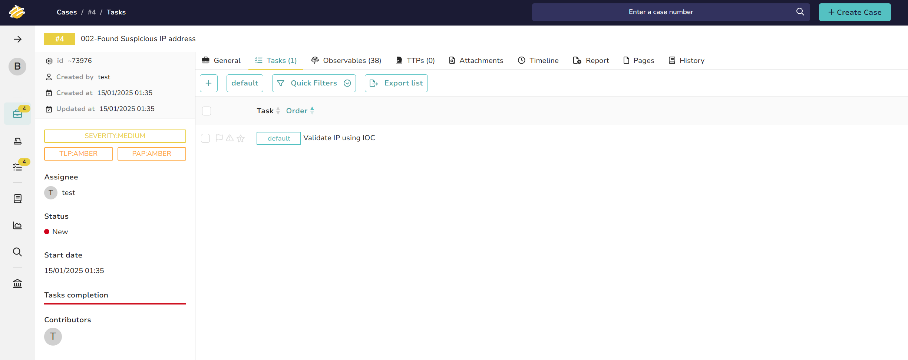
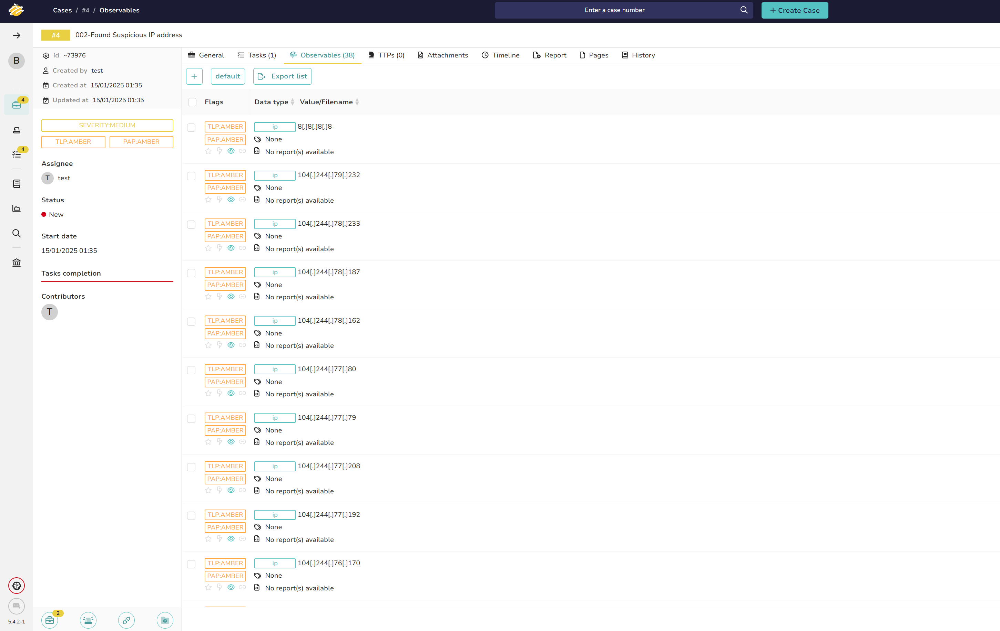
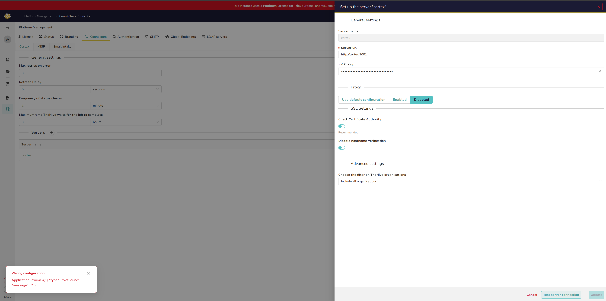
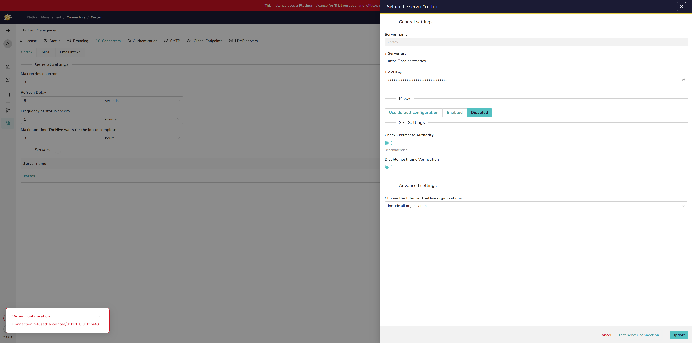
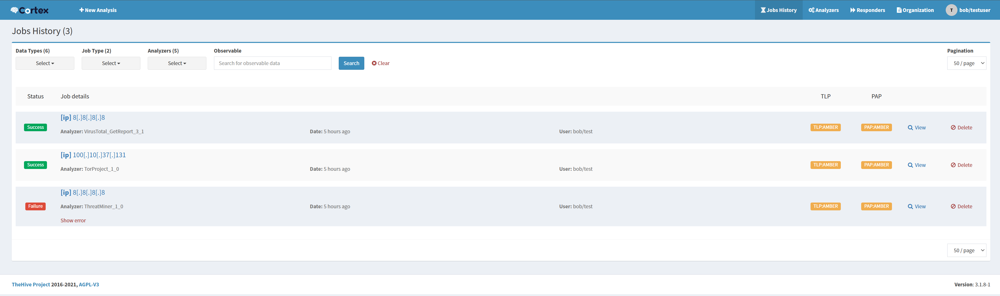

# SOAR

TheHive + Cortex + Python

## Install

`https://docs.strangebee.com/thehive/installation/docker/`

### 환경 설정

[Settings](./docs/settings.md "Settings")

## Scenario - [mermaid](./docs/scenario.md "Flow Chart")

1. 이상 IP 접근 탐지

2. TheHive에서 사례 및 작업 생성

3. Cortex를 통한 IP 분석

4. 분석 결과 검토

5. 이상 IP인 경우 접근 차단

6. 보고서 생성

## Workbook

[Workbook](./docs/workbook.md "Workbook")

## Playbook

[Playbook](./docs/playbook.md "Playbook")

## Flow Analysis

### 이상 IP 접근

이상 IP가 접근했다고 가정하고 해당 접근에 대한 Case를 생성한다. 
이상 IP는 [IP_LIST](./src/vulnerable_ip.txt "IP_LISt")를 사용하였다.

### Case 생성 자동화

TheHive API를 이용하여 case 생성

### Task 생성

TheHive API를 이용하여 Task 생성

### Observable 생성

TheHive API를 이용하여 각 IP 마다 Observable 생성

### (TODO) Analyzer

> [!CAUTION]
> ⚠️ TheHive와 Cortex 연결이 안되어 현재재 코드로만 구현 / Nginx 문제로 생각됨

### (TODO) Alert 생성

TODO
