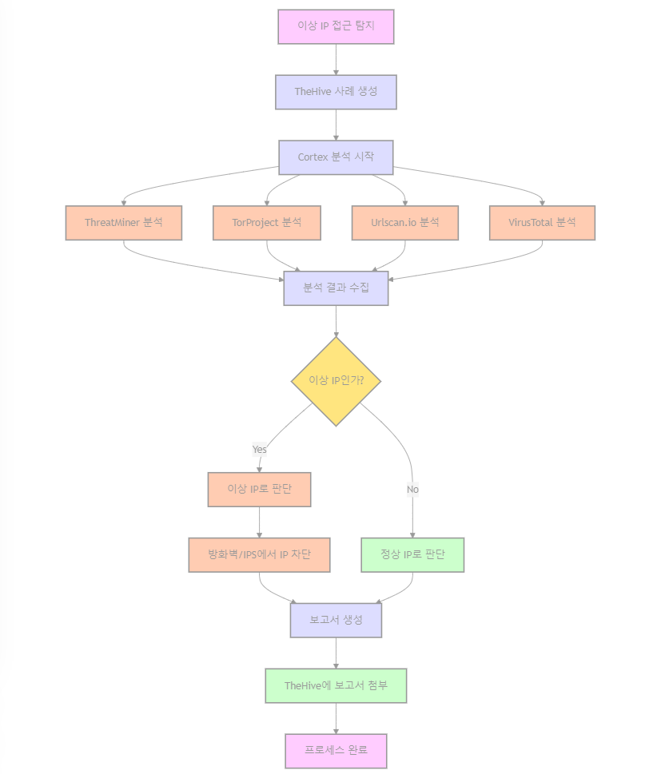

# SOAR

TheHive + Cortex + Python

## Install Guide

`https://docs.strangebee.com/thehive/installation/docker/`

## Scenario - [mermaid](./scenario.md "Flow Chart")

1. 이상 IP 접근 탐지

2. TheHive에서 사례 및 작업 생성

3. Cortex를 통한 IP 분석

4. 분석 결과 검토

5. 이상 IP인 경우 접근 차단

6. 보고서 생성
