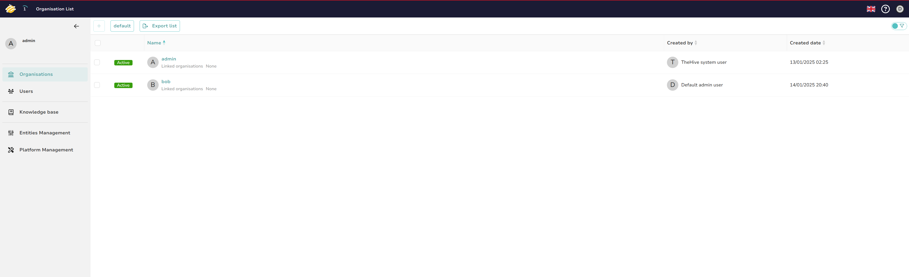
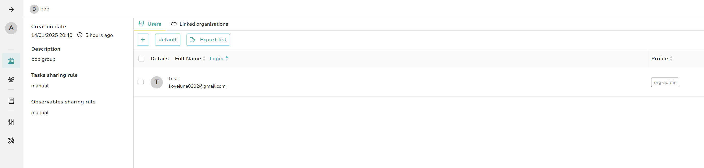
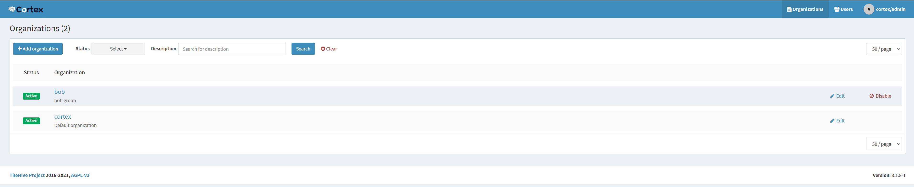
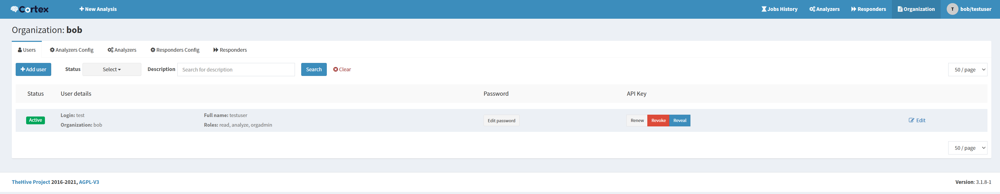
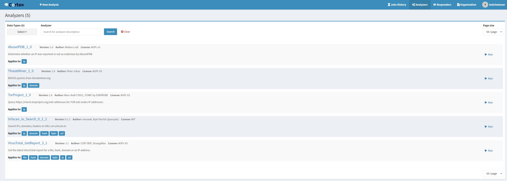
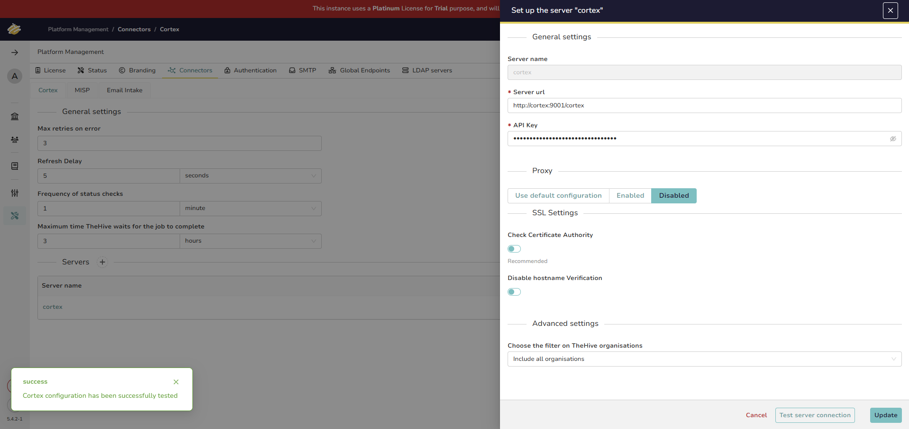

# Settings

## Organization & User 추가

theHive에 `bob` 추가

theHive에 `test` 사용자 추가

cortex에 `bob` organization 추가

cortex에 `test` 사용자 추가

## Cortex Analyzer 추가

이상 ip 검색을 위해 ThreatMiner, TorProject. VirusTotal, Urlscan, AbuseIPDB 추가

## TheHive와 Cortex 연결

TheHive에서 Cortex Job을 실행하기 위해 Cortex 연결
