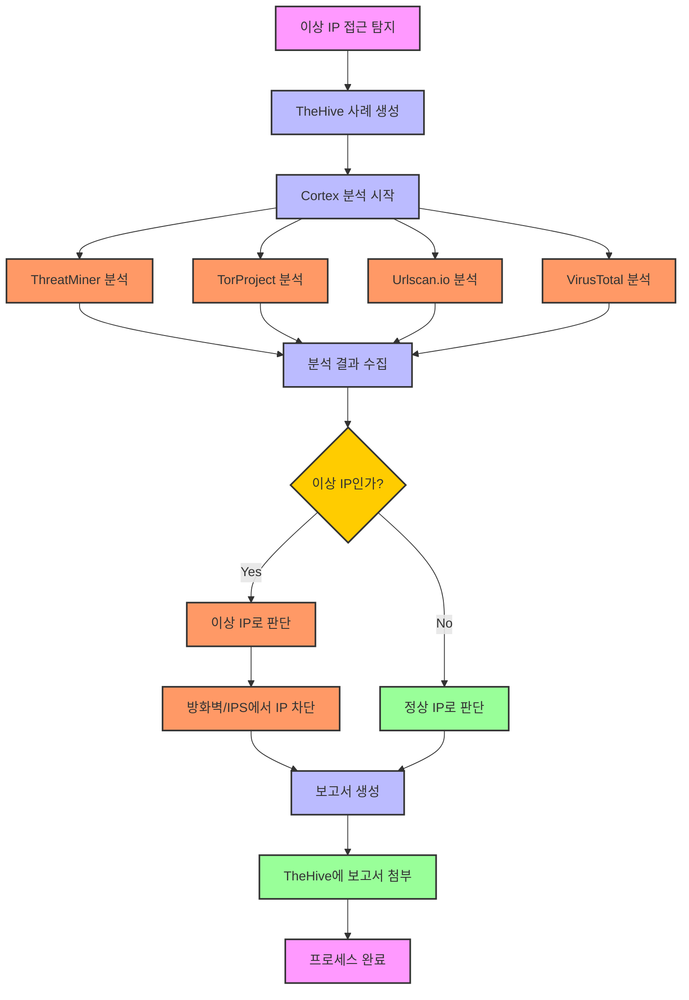

# Flow Chart

```mermaid
graph TD
    A[이상 IP 접근 탐지] --> B[TheHive 사례 생성]
    B --> C[Cortex 분석 시작]
    C --> D1[ThreatMiner 분석]
    C --> D2[TorProject 분석]
    C --> D3[Urlscan.io 분석]
    C --> D4[VirusTotal 분석]
    D1 --> E[분석 결과 수집]
    D2 --> E
    D3 --> E
    D4 --> E
    E --> F{이상 IP인가?}
    F -->|Yes| G[이상 IP로 판단]
    F -->|No| H[정상 IP로 판단]
    G --> I[방화벽/IPS에서 IP 차단]
    I --> J[보고서 생성]
    H --> J[보고서 생성]
    J --> K[TheHive에 보고서 첨부]
    K --> L[프로세스 완료]

    style A fill:#f9f,stroke:#333,stroke-width:2px
    style B fill:#bbf,stroke:#333,stroke-width:2px
    style C fill:#bbf,stroke:#333,stroke-width:2px
    style D1 fill:#f96,stroke:#333,stroke-width:2px
    style D2 fill:#f96,stroke:#333,stroke-width:2px
    style D3 fill:#f96,stroke:#333,stroke-width:2px
    style D4 fill:#f96,stroke:#333,stroke-width:2px
    style E fill:#bbf,stroke:#333,stroke-width:2px
    style F fill:#ffcc00,stroke:#333,stroke-width:2px
    style G fill:#f96,stroke:#333,stroke-width:2px
    style H fill:#9f9,stroke:#333,stroke-width:2px
    style I fill:#f96,stroke:#333,stroke-width:2px
    style J fill:#bbf,stroke:#333,stroke-width:2px
    style K fill:#9f9,stroke:#333,stroke-width:2px
    style L fill:#f9f,stroke:#333,stroke-width:2px
```
